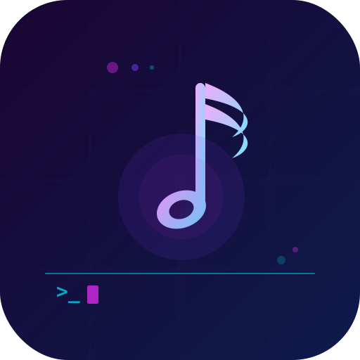

<div align="center">
  

  # Musician + Orchestra

  **The provider-agnostic LLM CLI that grows with you.**

  Talk to any LLM. Automate with agents. Remember everything. Ship faster.

  
  
  
  

</div>

---

## Why Musician?

Most LLM CLIs lock you into one provider, forget everything between sessions, and fall apart the moment you need more than a single chat window.

Musician was built to fix that:

- **No vendor lock-in.** Switch between Claude, Gemini, MiniMax, Codex, Ollama, or any OpenAI-compatible endpoint with a single config change. Your workflows, your muscle memory — all intact.
- **It remembers.** Persistent memory backed by SQLite FTS5 means context survives across sessions. Stop re-explaining your project every time you open a new terminal.
- **It gets smarter.** The SKILL.md engine lets Musician learn new capabilities from plain markdown files. Drop in a skill, and it's immediately available — no recompilation, no deploys.
- **It orchestrates.** Orchestra ships as a first-class plugin, turning your single-agent CLI into a multi-agent system capable of parallel reasoning, delegation, and complex task decomposition.

---

## Feature Comparison

| Feature | Musician + Orchestra | oh-my-claudecode | Raw LLM CLI tools |
|---------|:--------------------:|:----------------:|:-----------------:|
| Provider-agnostic | ✅ | ❌ Claude only | ⚠️ varies |
| Multi-agent orchestration | ✅ via Orchestra | ✅ | ❌ |
| Persistent memory (SQLite FTS5) | ✅ | ❌ | ❌ |
| Self-improving skills (SKILL.md) | ✅ | ❌ | ❌ |
| Zero-install binary (Burrito) | ✅ | ❌ | ⚠️ varies |
| SSE streaming | ✅ | ✅ | ⚠️ varies |
| Device Code + PKCE auth | ✅ | ❌ | ❌ |
| Plugin system | ✅ | ⚠️ limited | ❌ |
| Built in Elixir / OTP | ✅ | ❌ | ❌ |

---

## Providers

Connect to any of these out of the box:

**MiniMax** · **Claude** · **Codex** · **Gemini** · **Ollama** · **any OpenAI-compatible endpoint**

Auth flows supported: API key, Device Code (Codex), PKCE — all handled transparently.

---

## Quick Start

```sh
# Clone and install dependencies
git clone https://github.com/your-org/orchestra.git && cd orchestra
mix deps.get

# Run the full test suite (184 tests, 0 failures)
mix test

# Run the full CI pipeline
mix pipeline

# Build a zero-install binary (requires Zig 0.13.0)
mix release

# Or use the Makefile for common dev targets
make test
make test-e2e MINIMAX_API_KEY=sk-cp-...
make codex-login && make test-codex
```

**Requirements:** Elixir 1.17+, Erlang/OTP 26+. Zig 0.13.0 for binary builds only.

---

## Running Musician

### Configuration

Create `~/.musician/config.yaml`:

```yaml
provider: minimax
providers:
  minimax:
    api_base: https://api.minimaxi.chat/v1
    model: MiniMax-Text-01
    api_key_env: MINIMAX_API_KEY
  claude:
    api_base: https://api.anthropic.com
    model: claude-sonnet-4-20250514
    api_key_env: ANTHROPIC_API_KEY
```

See [spec/musician-architecture.md](spec/musician-architecture.md) for the full config schema and all supported providers.

### Interactive TUI

```sh
# Via IEx (recommended for development)
cd orchestra
mix deps.get
iex -S mix
iex> MusicianTui.start()

# Or with a specific provider on the command line
MIX_ENV=prod iex -S mix
iex> MusicianTui.start()
```

The TUI starts the Orchestra plugin automatically. Once loaded, use `/orchestra` commands to interact with multi-agent features.

### Non-Interactive / Single Prompt

```sh
# Set your API key
export MINIMAX_API_KEY=sk-cp-...

# Pipe a prompt through the CLI
echo "Explain this codebase" | MIX_ENV=prod iex -S mix
```

### Orchestra Multi-Agent Commands

Orchestra is a plugin — it loads on startup and registers `/orchestra` commands for multi-agent coordination:

```sh
/orchestra help        # Show available orchestra commands
/orchestra team        # Team agent coordination
/orchestra ralph      # Self-verification loop
/orchestra tmux       # Tmux-based orchestration backend
/orchestra worktree    # Isolated git worktree for agent tasks
```

See [spec/musician-architecture.md](spec/musician-architecture.md) for how Orchestra fits into the dependency tree.

### One-Line Setup

```sh
git clone https://github.com/your-org/orchestra.git && cd orchestra && mix deps.get && iex -S mix
```

---

## Architecture

Musician is an Elixir umbrella application. Orchestra is a plugin that rides on top.

```
musician/          # Core CLI — provider adapter, streaming, auth, TUI
orchestra/         # Multi-agent orchestration plugin
  └── agents/      # Agent definitions and coordination logic
  └── skills/      # SKILL.md engine
  └── memory/      # SQLite FTS5 persistent store
```

Full details:

- [AGENTS.md](AGENTS.md) — Architecture guide and agent roles
- [spec/musician-architecture.md](spec/musician-architecture.md) — Umbrella structure and core abstractions
- [spec/musician-providers.md](spec/musician-providers.md) — Provider system and SSE streaming
- [spec/musician-testing.md](spec/musician-testing.md) — Testing strategy and E2E conventions
- [spec/musician-cli.md](spec/musician-cli.md) — CLI entrypoint, Mix tasks, Burrito binary
- [.archgate/adrs/](.archgate/adrs/) — Architecture Decision Records

**claude-code reference specs:**
- [spec/architecture.md](spec/architecture.md) — claude-code system architecture
- [spec/tools.md](spec/tools.md) — Tool system specification
- [spec/commands.md](spec/commands.md) — Command system specification
- [spec/state-management.md](spec/state-management.md) — State management patterns
- [spec/decompilation.md](spec/decompilation.md) — Source recovery methodology

---

## What's Next

- [ ] Phase 6: Web UI via Phoenix LiveView
- [ ] Tool call sandboxing and approval flows
- [ ] Provider cost tracking and budget guardrails
- [ ] Distributed agent clusters over OTP distribution
- [ ] Published Burrito binary releases

---

## License

See [LICENSE](LICENSE).
